# Secure Small-Business Enterprise Network (Coffee Shop Branch)

A production-ready small-business enterprise local area network (LAN) designed and validated in **Cisco Packet Tracer**. This project simulates an end-to-end network implementation for a multi-zone commercial environment ("Mike's Coffee Shop"), demonstrating network segmentation, Inter-VLAN routing (Router-on-a-Stick), dynamic addressing via Cisco IOS DHCP pools, hardened device administration, and security boundaries using extended Access Control Lists (ACLs).

---

## 📁 Network Implementation Modules

* 🏢 [View Section 1: Executive Summary & Design Objectives](#section-1-executive-summary--design-objectives) — *Business use case, physical layout, and zero-trust zone isolation.*
* 🗺 [View Section 2: Network Topology Architecture](#section-2-network-topology-architecture) — *Interactive Mermaid render & packet flow breakdown.*
* 📊 [View Section 3: IP Addressing & VLAN Segmentation Scheme](#section-3-ip-addressing--vlan-segmentation-scheme) — *Subnet planning, gateways, static exclusions, and port mapping.*
* 🛠 [View Section 4: Switch Layer 2 & Hardening Configuration](#section-4-switch-layer-2--hardening-configuration) — *VLAN database, PortFast, 802.1Q trunk, SVI management, and SSHv2.*
* 🌐 [View Section 5: Router-on-a-Stick, DHCP & ACL Security Configuration](#section-5-router-on-a-stick-dhcp--acl-security-configuration) — *Sub-interfaces, DHCP scopes, and inbound Extended ACLs.*
* 🖨 [View Section 6: End-Device & Wireless Infrastructure Setup](#section-6-end-device--wireless-infrastructure-setup) — *Printers static provisioning, AP WPA2-PSK, and wireless client association.*
* 📜 [View Section 7: Running-Configuration Proofs (show run)](#section-7-running-configuration-proofs-show-run) — *CLI audit proofs captured across router and switch.*
* 🧪 [View Section 8: Connectivity Validation & Security Isolation Tests](#section-8-connectivity-validation--security-isolation-tests) — *Ping tests, gateway reachability, and ACL quarantine verification.*
* 💡 [View Section 9: Key Engineering Takeaways](#section-9-key-engineering-takeaways) — *Best practices regarding DHCP bootstrapping, port safety, and management planes.*

---

<a name="section-1-executive-summary--design-objectives"></a>
## 🏢 Section 1: Executive Summary & Design Objectives

This section details the business operational requirements, multi-zone isolation needs, and primary engineering objectives for Mike's Coffee Shop.

<details>
<summary>▶ <b>Click to view Executive Summary & Architecture Objectives</b></summary>
<br>

### Business Overview
In a commercial establishment like a modern café or retail branch, business operations require three core capabilities:
1. **Administrative Operations:** Secure workstation access and network printing for store management.
2. **Point-of-Sale (POS) Transactions:** Reliable, low-latency transaction processing and receipt generation isolated from general traffic.
3. **Public Wireless (Guest Wi-Fi):** Frictionless customer internet access that is strictly quarantined from internal business systems.

### Core Engineering Objectives
* **Zero-Trust Zone Isolation:** Separate management, financial/POS, and guest traffic into distinct Layer 2 broadcast domains (VLANs).
* **Router-on-a-Stick (ROAS):** Enable centralized Layer 3 inter-VLAN routing across a single 802.1Q trunk link.
* **Granular Traffic Quarantining (Extended ACL):** Ensure guest clients can reach DNS/DHCP and external WAN routes while completely dropping traffic headed towards internal subnets.
* **Deterministic IP Planning:** Reserve static pools (`.1`–`.20`) for critical default gateways and network printers, while dynamically leasing addresses (`.21`+) to PCs and wireless endpoints.
* **Management Hardening:** Enforce SSHv2 remote administrative access, MD5/Scrypt privileged secrets, MOTD banners, and console line security.

</details>

---

<a name="section-2-network-topology-architecture"></a>
## 🗺 Section 2: Network Topology Architecture

This section renders the physical and logical layout of the Coffee Shop deployment directly inside GitHub using Native Mermaid markdown.

<details>
<summary>▶ <b>Click to view Network Topology Diagram & Packet Flow</b></summary>
<br>

### Native Interactive Topology Diagram

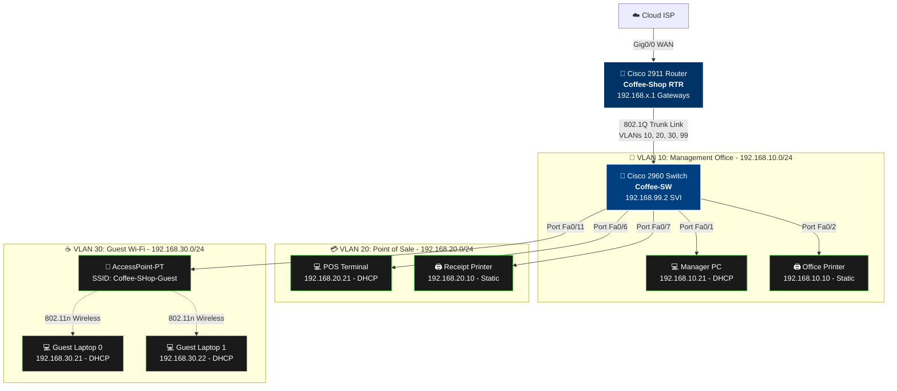

### Topology Snapshot (Packet Tracer)
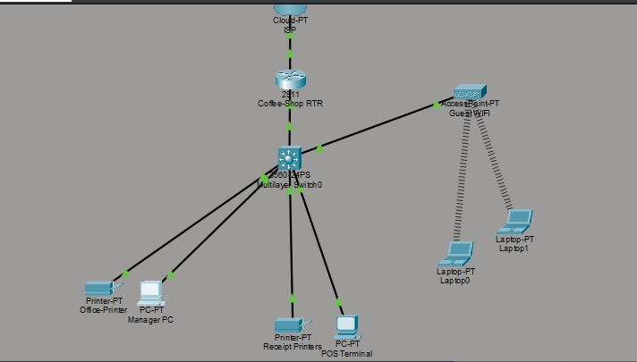

</details>

---

<a name="section-3-ip-addressing--vlan-segmentation-scheme"></a>
## 📊 Section 3: IP Addressing & VLAN Segmentation Scheme

This section outlines the IP allocation matrix, subnet masks, default gateways, and physical switch port reservations.

<details>
<summary>▶ <b>Click to view Detailed IP Addressing & Subnet Matrix</b></summary>
<br>

| VLAN ID | VLAN Name | Subnet | Gateway | Static Pool (Reserved) | DHCP Pool Range | Assigned Ports |
|:---|:---|:---|:---|:---|:---|:---|
| **10** | `managment_office` | `192.168.10.0/24` | `192.168.10.1` | `192.168.10.1` - `.20` | `192.168.10.21` - `.254` | `Fa0/1` - `Fa0/5` |
| **20** | `POS` | `192.168.20.0/24` | `192.168.20.1` | `192.168.20.1` - `.20` | `192.168.20.21` - `.254` | `Fa0/6` - `Fa0/10` |
| **30** | `GUEST_WIFI` | `192.168.30.0/24` | `192.168.30.1` | `192.168.30.1` - `.20` | `192.168.30.21` - `.254` | `Fa0/11` |
| **99** | `Network_Management`| `192.168.99.0/24` | `192.168.99.1` | `192.168.99.1` - `.20` | N/A (Static SVI: `.2`) | Internal / Trunk |

</details>
---

<a name="section-4-switch-layer-2--hardening-configuration"></a>
## 🛠 Section 4: Switch Layer 2 & Hardening Configuration

This section contains all CLI commands deployed on `Coffee-SW` (Cisco Catalyst 2960) including VLAN segmentation, Spanning-Tree PortFast, 802.1Q trunking, SVI configuration, and SSHv2 line hardening.

<details>
<summary>▶ <b>Click to view Switch CLI Configuration Script</b></summary>
<br>

```cisco
! ==========================================
! SWITCH CONFIGURATION: Coffee-SW (Cisco 2960)
! ==========================================

! --- Hostname, Passwords & CLI Usability ---
Switch> enable
Switch# configure terminal
Switch(config)# hostname Coffee-SW
Coffee-SW(config)# no ip domain-lookup
Coffee-SW(config)# service password-encryption
Coffee-SW(config)# enable secret Cisco123!
Coffee-SW(config)# banner motd ^C Unauthorized Access Prohibited ^C

! --- SSHv2 Remote Management Setup ---
Coffee-SW(config)# ip domain-name singh.com
Coffee-SW(config)# crypto key generate rsa general-keys modulus 1024
Coffee-SW(config)# ip ssh version 2
Coffee-SW(config)# username admin privilege 15 secret AdminPass123!

! --- Line Hardening ---
Coffee-SW(config)# line con 0
Coffee-SW(config-line)# password ConsolePass123!
Coffee-SW(config-line)# logging synchronous
Coffee-SW(config-line)# exit
Coffee-SW(config)# line vty 0 15
Coffee-SW(config-line)# login local
Coffee-SW(config-line)# transport input ssh
Coffee-SW(config-line)# exit

! --- VLAN Creation & Port Allocation ---
Coffee-SW(config)# vlan 10
Coffee-SW(config-vlan)# name managment_office
Coffee-SW(config)# vlan 20
Coffee-SW(config-vlan)# name POS
Coffee-SW(config)# vlan 30
Coffee-SW(config-vlan)# name GUEST_WIFI
Coffee-SW(config)# vlan 99
Coffee-SW(config-vlan)# name Network_Managment
Coffee-SW(config-vlan)# exit

! --- Assign Access Ports with STP PortFast ---
Coffee-SW(config)# interface range fa0/1 - 5
Coffee-SW(config-if-range)# description #Managment_office#
Coffee-SW(config-if-range)# switchport mode access
Coffee-SW(config-if-range)# switchport access vlan 10
Coffee-SW(config-if-range)# spanning-tree portfast
Coffee-SW(config-if-range)# exit

Coffee-SW(config)# interface range fa0/6 - 10
Coffee-SW(config-if-range)# description #POS#
Coffee-SW(config-if-range)# switchport mode access
Coffee-SW(config-if-range)# switchport access vlan 20
Coffee-SW(config-if-range)# spanning-tree portfast
Coffee-SW(config-if-range)# exit

Coffee-SW(config)# interface fa0/11
Coffee-SW(config-if)# description # Guest_WIFI#
Coffee-SW(config-if)# switchport mode access
Coffee-SW(config-if)# switchport access vlan 30
Coffee-SW(config-if)# spanning-tree portfast
Coffee-SW(config-if)# exit

! --- 802.1Q Trunk Link to Router ---
Coffee-SW(config)# interface gig0/1
Coffee-SW(config-if)# description #TO_Coffee_Shop_RTR#
Coffee-SW(config-if)# switchport trunk encapsulation dot1q
Coffee-SW(config-if)# switchport mode trunk
Coffee-SW(config-if)# switchport trunk allowed vlan 10,20,30,99
Coffee-SW(config-if)# exit

! --- Switch Virtual Interface (SVI) Management IP ---
Coffee-SW(config)# interface vlan 99
Coffee-SW(config-if)# description ##TO_Switch_Managment##
Coffee-SW(config-if)# ip address 192.168.99.2 255.255.255.0
Coffee-SW(config-if)# no shutdown
Coffee-SW(config-if)# exit
Coffee-SW(config)# ip default-gateway 192.168.99.1
Coffee-SW(config)# interface vlan 1
Coffee-SW(config-if)# shutdown
Coffee-SW(config-if)# exit
Coffee-SW(config)# do copy run start
```

</details>
---

<a name="section-5-router-on-a-stick-dhcp--acl-security-configuration"></a>
## 🌐 Section 5: Router-on-a-Stick, DHCP & ACL Security Configuration

This section provides the full configuration script for `Coffee-Shop RTR` (Cisco 2911) including 802.1Q sub-interfaces, dynamic DHCP scopes, and inbound Extended ACLs.

<details>
<summary>▶ <b>Click to view Router CLI Configuration Script</b></summary>
<br>

```cisco
! ==========================================
! ROUTER CONFIGURATION: Coffee-Shop RTR (Cisco 2911)
! ==========================================

! --- Hostname & System Security ---
Router> enable
Router# configure terminal
Router(config)# hostname RTR
RTR(config)# no ip domain-lookup
RTR(config)# service password-encryption
RTR(config)# enable secret Cisco123!
RTR(config)# banner motd ^C Unautorized access banned ^C

! --- Line Hardening ---
RTR(config)# line con 0
RTR(config-line)# password ConsolePass123!
RTR(config-line)# logging synchronous
RTR(config-line)# exit
RTR(config)# line vty 0 4
RTR(config-line)# login
RTR(config-line)# exit

! --- WAN Interface to ISP (Pre-staged) ---
RTR(config)# interface gig0/0
RTR(config-if)# description ## to_ISP##
RTR(config-if)# no shutdown
RTR(config-if)# exit

! --- Router-on-a-Stick Sub-interfaces ---
RTR(config)# interface gig0/1
RTR(config-if)# description ## to_SW1 ##
RTR(config-if)# no ip address
RTR(config-if)# no shutdown
RTR(config-if)# exit

RTR(config)# interface gig0/1.10
RTR(config-subif)# description ##Management_Office##
RTR(config-subif)# encapsulation dot1Q 10
RTR(config-subif)# ip address 192.168.10.1 255.255.255.0
RTR(config-subif)# exit

RTR(config)# interface gig0/1.20
RTR(config-subif)# description ## POS_Gateway##
RTR(config-subif)# encapsulation dot1Q 20
RTR(config-subif)# ip address 192.168.20.1 255.255.255.0
RTR(config-subif)# exit

RTR(config)# interface gig0/1.30
RTR(config-subif)# description ##GUEST_WIFI##
RTR(config-subif)# encapsulation dot1Q 30
RTR(config-subif)# ip address 192.168.30.1 255.255.255.0
RTR(config-subif)# exit

RTR(config)# interface gig0/1.99
RTR(config-subif)# description ##Network_Managment_gateway##
RTR(config-subif)# encapsulation dot1Q 99
RTR(config-subif)# ip address 192.168.99.1 255.255.255.0
RTR(config-subif)# exit

! --- DHCP Server Pools Configuration ---
RTR(config)# ip dhcp excluded-address 192.168.10.1 192.168.10.20
RTR(config)# ip dhcp excluded-address 192.168.20.1 192.168.20.20
RTR(config)# ip dhcp excluded-address 192.168.30.1 192.168.30.20

RTR(config)# ip dhcp pool managment_office
RTR(dhcp-config)# network 192.168.10.0 255.255.255.0
RTR(dhcp-config)# default-router 192.168.10.1
RTR(dhcp-config)# dns-server 8.8.8.8
RTR(dhcp-config)# exit

RTR(config)# ip dhcp pool POS
RTR(dhcp-config)# network 192.168.20.0 255.255.255.0
RTR(dhcp-config)# default-router 192.168.20.1
RTR(dhcp-config)# dns-server 8.8.8.8
RTR(dhcp-config)# exit

RTR(config)# ip dhcp pool GUEST_WIFI
RTR(dhcp-config)# network 192.168.30.0 255.255.255.0
RTR(dhcp-config)# default-router 192.168.30.1
RTR(dhcp-config)# dns-server 8.8.8.8
RTR(dhcp-config)# exit

! --- Extended Access Control List (Guest Network Isolation) ---
RTR(config)# ip access-list extended GUEST
RTR(config-ext-nacl)# permit udp any eq bootpc any eq bootps
RTR(config-ext-nacl)# deny ip 192.168.30.0 0.0.0.255 192.168.10.0 0.0.0.255
RTR(config-ext-nacl)# deny ip 192.168.30.0 0.0.0.255 192.168.20.0 0.0.0.255
RTR(config-ext-nacl)# deny ip 192.168.30.0 0.0.0.255 192.168.99.0 0.0.0.255
RTR(config-ext-nacl)# permit ip 192.168.30.0 0.0.0.255 any
RTR(config-ext-nacl)# exit

! --- Apply ACL Inbound on Guest Sub-interface ---
RTR(config)# interface gig0/1.30
RTR(config-subif)# ip access-group GUEST in
RTR(config-subif)# exit
RTR(config)# do copy run start
```

</details>

---
<a name="section-6-end-device--wireless-infrastructure-setup"></a>
## 🖨 Section 6: End-Device & Wireless Infrastructure Setup

This section documents static printer provisioning, access point wireless parameters, and client WPA2 associations.

<details>
<summary>▶ <b>Click to view End-Device & Wireless Setup Screenshots</b></summary>
<br>

### 1. Static IP Device Assignments

#### Office Printer (VLAN 10)
* **IP Address:** `192.168.10.10`
* **Subnet Mask:** `255.255.255.0`
* **Default Gateway:** `192.168.10.1`
* **DNS Server:** `8.8.8.8`

| Office Printer Global Settings | Office Printer FastEthernet0 Config |
|:---:|:---:|
| 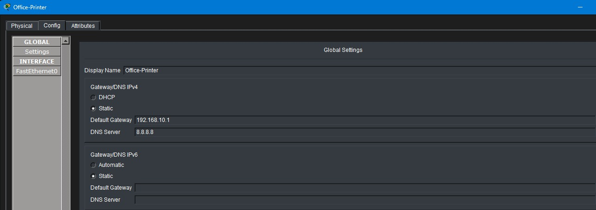 | 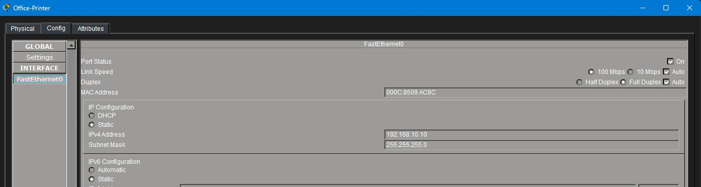 |

#### Receipt Printer (VLAN 20)
* **IP Address:** `192.168.20.10`
* **Subnet Mask:** `255.255.255.0`
* **Default Gateway:** `192.168.20.1`
* **DNS Server:** `8.8.8.8`

| Receipt Printer Global Settings | Receipt Printer FastEthernet0 Config |
|:---:|:---:|
| 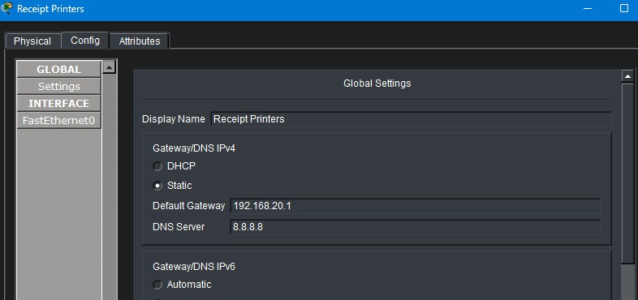 | 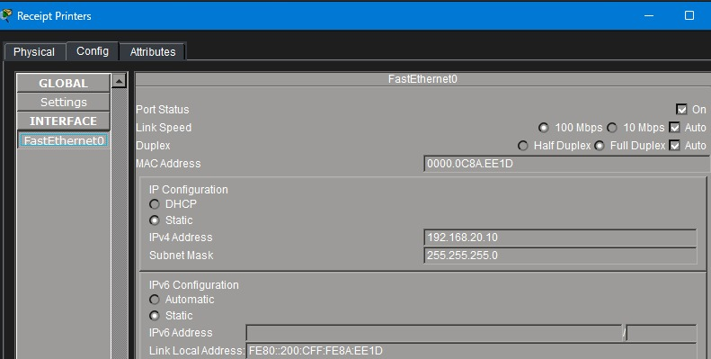 |

---

### 2. Wireless Access Point & Client Associations

* **SSID:** `Coffee-SHop-Guest`
* **Channel:** Channel 6 (2.4 GHz)
* **Security Protocol:** WPA2-PSK (AES Encryption)
* **Pre-shared Key (PSK):** `CofShop!!!`

| Access Point Port 1 Setup | Client WPA2-Personal Authentication |
|:---:|:---:|
| 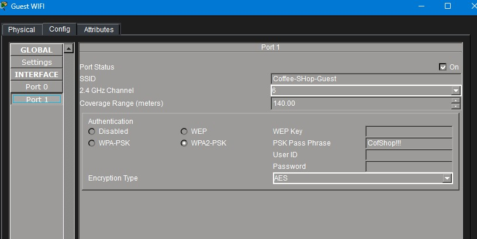 | 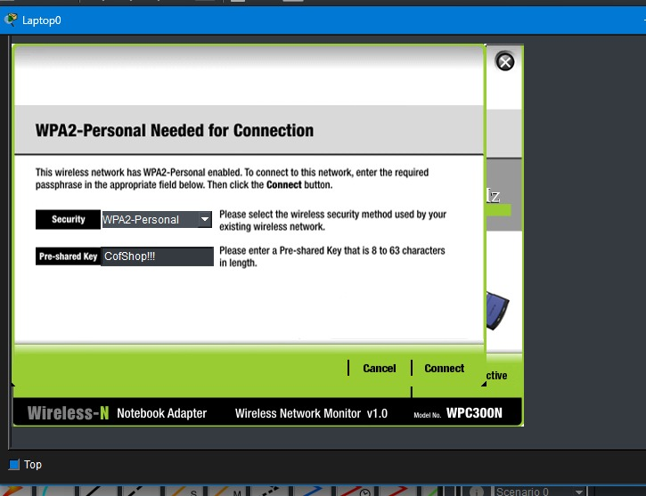 |

| Guest Client Association Status | Guest Laptop 0 DHCP Lease (`192.168.30.21`) |
|:---:|:---:|
| 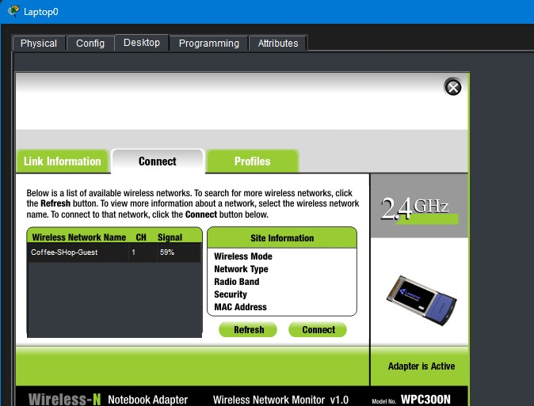 | 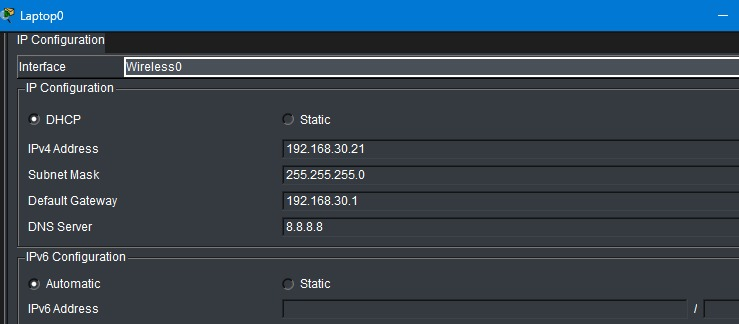 |

</details>

---

<a name="section-7-running-configuration-proofs-show-run"></a>
## 📜 Section 7: Running-Configuration Proofs (`show run`)

This section provides visual audit proof of all running-configurations across the router and switch.

<details>
<summary>▶ <b>Click to view Router & Switch running-config proofs</b></summary>
<br>

### Router Running-Config Proofs (`RTR# do sh run`)

| Router Services & DHCP Exclusions | Router DHCP Pools & Hardware UDI |
|:---:|:---:|
| 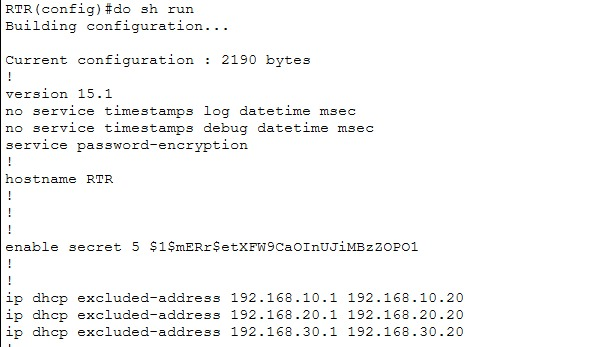 | 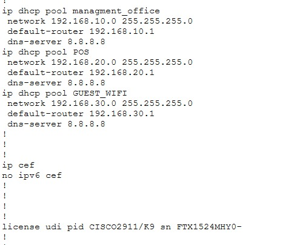 |

| WAN & Management Office Sub-Interface (`Gi0/1.10`) | POS, Guest & Management Sub-Interfaces (`.20`, `.30`, `.99`) | Router Extended ACL (`GUEST`) & Line Configs |
|:---:|:---:|:---:|
| 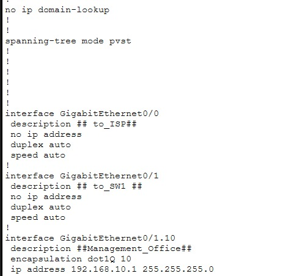 | 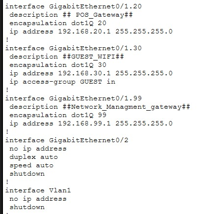 | 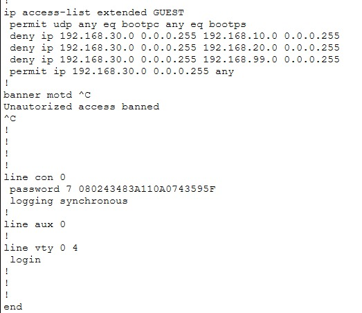 |

---

### Switch Running-Config Proofs (`Coffee-SW# sh run`)

| Switch Hostname, Secrets & SSH Config | Switch Access Ports (`Fa0/1` – `Fa0/3` in VLAN 10) | Switch Access Ports (`Fa0/4` – `Fa0/8` in VLAN 10 & 20) |
|:---:|:---:|:---:|
| 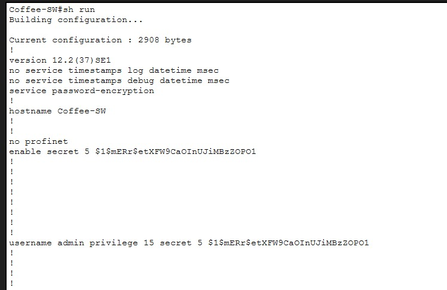 | 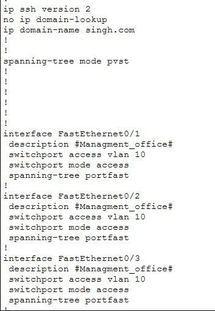 | 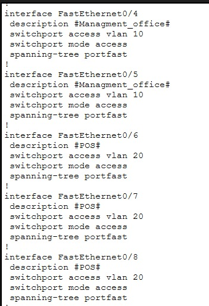 |

| Switch Access Ports (`Fa0/9` – `Fa0/11` in VLAN 20 & 30) | Switch Trunk Uplink (`Gi0/1`) & SVI (`Vlan99`) | Switch Line VTY & Console Security |
|:---:|:---:|:---:|
| 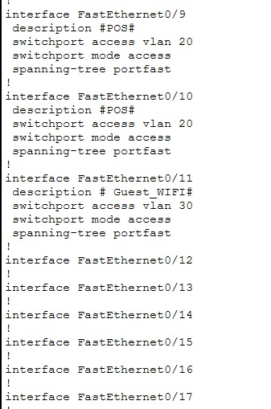 | 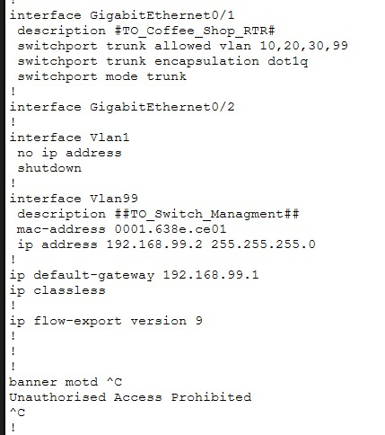 | 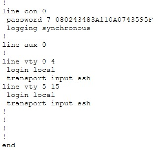 |

</details>

---
<a name="section-8-connectivity-validation--security-isolation-tests"></a>
## 🧪 Section 8: Connectivity Validation & Security Isolation Tests

This section contains verification ping tests demonstrating successful Intra-VLAN communication, gateway reachability, and zero-trust ACL blocking.

<details>
<summary>▶ <b>Click to view Connectivity Verification & ACL Tests</b></summary>
<br>

### 1. Inter-VLAN Routing & Office LAN Validation
From **Manager PC** (`192.168.10.x`), traffic successfully reaches the local printer (`192.168.10.10`) and default gateway (`192.168.10.1`) with `<1ms` round-trip latency.

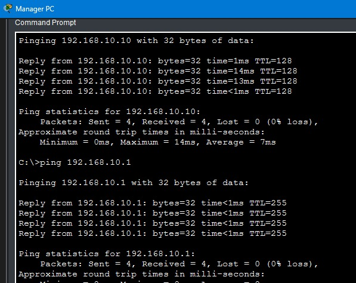

---

### 2. POS Terminal Connectivity
The **POS Terminal** verifies instant communication with its default gateway (`192.168.20.1`) and receipt printer (`192.168.20.10`) with 0% packet loss.

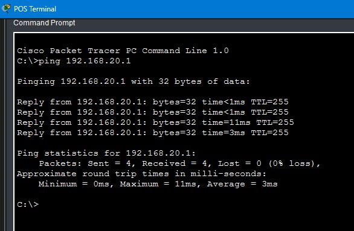

---

### 3. Guest ACL Isolation & Quarantine Test
From **Laptop0** (`192.168.30.21`):
* **Ping to POS Subnet (`192.168.20.1`):** `Destination host unreachable` (Explicitly blocked by ACL `GUEST`).
* **Ping within Guest Subnet (`192.168.30.22`):** `4/4 packets successful` (Intra-subnet communication working).

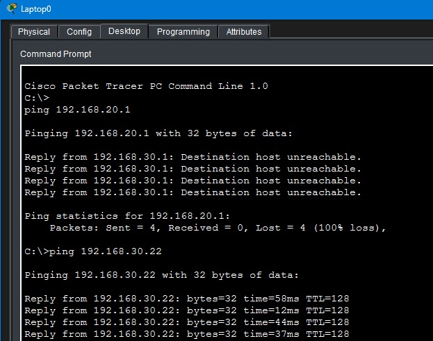

</details>

---

<a name="section-9-key-engineering-takeaways"></a>
## 💡 Section 9: Key Engineering Takeaways

This section synthesizes the core technical insights gained throughout this implementation.

<details>
<summary>▶ <b>Click to view Key Engineering Insights</b></summary>
<br>

1. **DHCP Bootstrapping inside ACLs:** When applying an inbound ACL on a DHCP client subnet, standard `deny` rules will drop broadcast DHCP requests unless `permit udp any eq bootpc any eq bootps` is placed at top-of-stack.
2. **Deterministic Port Mapping:** Grouping switch ports sequentially (`1-5` Office, `6-10` POS, `11` AP) reduces administrative overhead and makes on-site physical troubleshooting straightforward.
3. **Defense-in-Depth for Management:** Disabling telnet across VTY lines via `transport input ssh` and routing management through an isolated SVI (`VLAN 99`) protects infrastructure from rogue LAN discovery.

</details>
