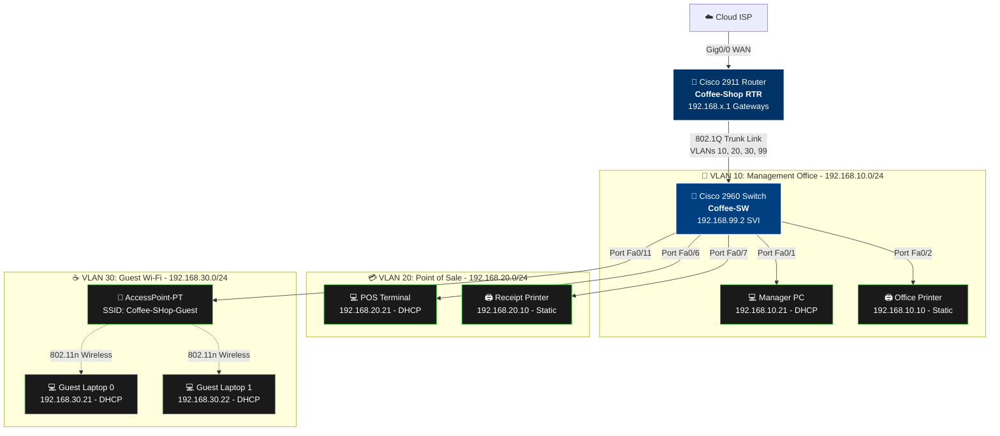

readme_structured = """# Secure Small-Business Enterprise Network (Coffee Shop Branch)

A production-ready small-business enterprise local area network (LAN) designed and validated in **Cisco Packet Tracer**. This project simulates an end-to-end network implementation for a multi-zone commercial environment ("Mike's Coffee Shop"), demonstrating network segmentation, Inter-VLAN routing (Router-on-a-Stick), dynamic addressing via Cisco IOS DHCP pools, hardened device administration, and security boundaries using extended Access Control Lists (ACLs).

---

## 📁 Network Implementation Modules

* 🏢 [View Section 1: Executive Summary & Design Objectives](#section-1-executive-summary--design-objectives) — *Business use case, physical layout, and zero-trust zone isolation.*
* 🗺 [View Section 2: Network Topology Architecture](#section-2-network-topology-architecture) — *Interactive Mermaid render & packet flow breakdown.*
* 📊 [View Section 3: IP Addressing & VLAN Segmentation Scheme](#section-3-ip-addressing--vlan-segmentation-scheme) — *Subnet planning, gateways, static exclusions, and port mapping.*
* 🛠 [View Section 4: Switch Layer 2 & Hardening Configuration](#section-4-switch-layer-2--hardening-configuration) — *VLAN database, PortFast, 802.1Q trunk, SVI management, and SSHv2.*
* 🌐 [View Section 5: Router-on-a-Stick, DHCP & ACL Security Configuration](#section-5-router-on-a-stick-dhcp--acl-security-configuration) — *Sub-interfaces, DHCP scopes, and inbound Extended ACLs.*
* 🖨 [View Section 6: End-Device & Wireless Infrastructure Setup](#section-6-end-device--wireless-infrastructure-setup) — *Printers static provisioning, AP WPA2-PSK, and wireless client association.*
* 📜 [View Section 7: Running-Configuration Proofs (show run)](#section-7-running-configuration-proofs-show-run) — *CLI audit proofs captured across router and switch.*
* 🧪 [View Section 8: Connectivity Validation & Security Isolation Tests](#section-8-connectivity-validation--security-isolation-tests) — *Ping tests, gateway reachability, and ACL quarantine verification.*
* 💡 [View Section 9: Key Engineering Takeaways](#section-9-key-engineering-takeaways) — *Best practices regarding DHCP bootstrapping, port safety, and management planes.*

---

## 🏢 Section 1: Executive Summary & Design Objectives

This section details the business operational requirements, multi-zone isolation needs, and primary engineering objectives for Mike's Coffee Shop.

▶ <b>Click to view Executive Summary & Architecture Objectives</b>

 

### Business Overview
In a commercial establishment like a modern café or retail branch, business operations require three core capabilities:
1. **Administrative Operations:** Secure workstation access and network printing for store management.
2. **Point-of-Sale (POS) Transactions:** Reliable, low-latency transaction processing and receipt generation isolated from general traffic.
3. **Public Wireless (Guest Wi-Fi):** Frictionless customer internet access that is strictly quarantined from internal business systems.

### Core Engineering Objectives
* **Zero-Trust Zone Isolation:** Separate management, financial/POS, and guest traffic into distinct Layer 2 broadcast domains (VLANs).
* **Router-on-a-Stick (ROAS):** Enable centralized Layer 3 inter-VLAN routing across a single 802.1Q trunk link.
* **Granular Traffic Quarantining (Extended ACL):** Ensure guest clients can reach DNS/DHCP and external WAN routes while completely dropping traffic headed towards internal subnets.
* **Deterministic IP Planning:** Reserve static pools (`.1`–`.20`) for critical default gateways and network printers, while dynamically leasing addresses (`.21`+) to PCs and wireless endpoints.
* **Management Hardening:** Enforce SSHv2 remote administrative access, MD5/Scrypt privileged secrets, MOTD banners, and console line security.

---

## 🗺 Section 2: Network Topology Architecture

This section renders the physical and logical layout of the Coffee Shop deployment directly inside GitHub using Native Mermaid markdown.

▶ <b>Click to view Network Topology Diagram & Packet Flow</b>

 

### Native Interactive Topology Diagram

### Topology Snapshot (Packet Tracer)

---
